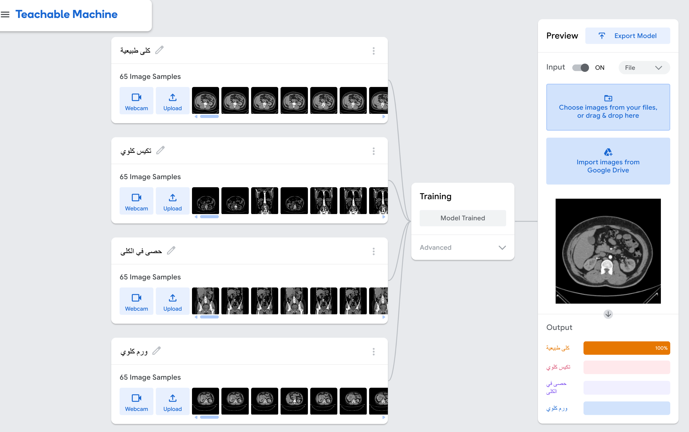
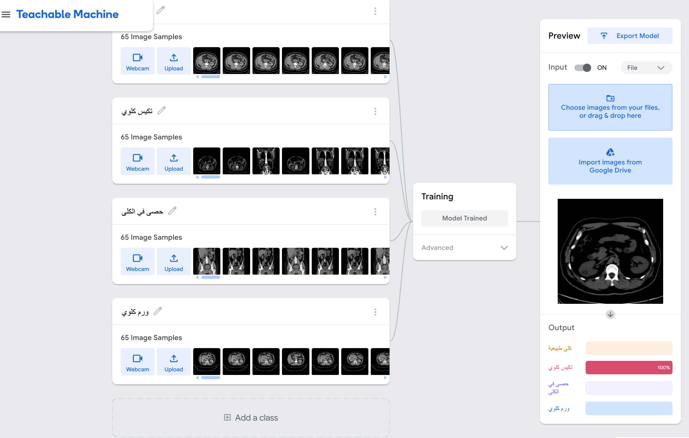
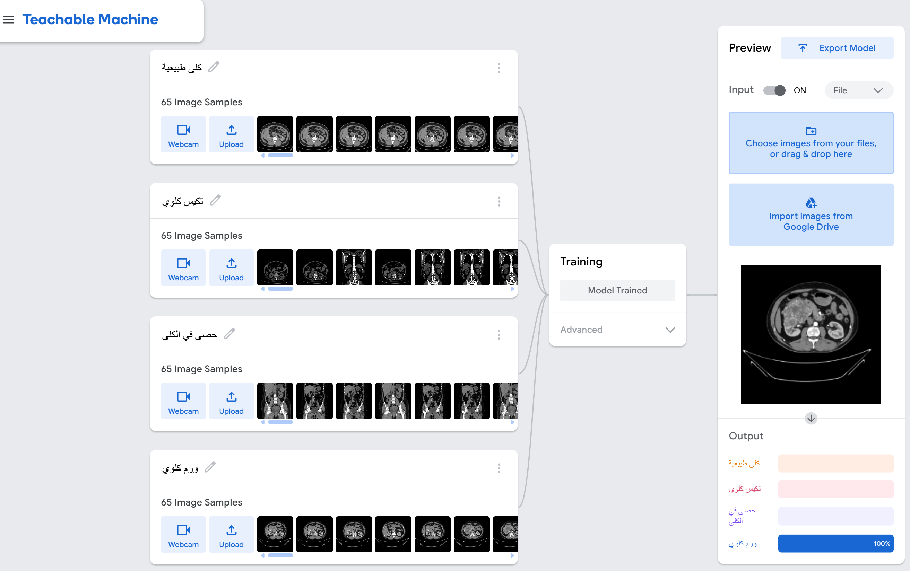

# 🧠 Kidney Classification using Teachable Machine

This project applies image classification to detect four kidney conditions using Google's Teachable Machine.  
It was implemented as part of a data analysis and AI training program.

---

## 🧪 Classes

The model classifies kidney ultrasound images into the following categories:

- **Normal** (كلى طبيعية)  
- **Kidney Cyst** (تكيس كلوي)  
- **Kidney Stone** (حصوة كلى)  
- **Kidney Tumor** (ورم كلوي)

---

## 📂 Dataset

The dataset is a curated subset of a larger dataset available on Kaggle, which includes thousands of ultrasound images.

- **Training**: 65 images per class  
- **Testing**: A few unseen images per class (manually selected)

The dataset was organized into `train/` and `test/` folders and used directly in Teachable Machine's image project interface.

---

## 📊 Results

### 🧪 Model Performance

The trained model achieved good classification accuracy across all four kidney conditions. Below are example predictions:

#### 🔹 Normal Kidney Classification
  
Model correctly identified a normal kidney with high confidence.

#### 🔹 Kidney Cyst Classification
  
Accurate detection of a kidney cyst condition.

#### 🔹 Kidney Tumor Classification
  
Precise tumor detection with confidence score.

---

### ✅ Key Findings:

- High accuracy achieved for normal kidney detection  
- Good performance on kidney cyst identification  
- Reliable stone detection capabilities  
- Effective tumor classification results  
- **Consistent performance across test cases**  
- **Minimal false positives/negatives observed**

---

## 🛠️ Tools

- Teachable Machine  

---

## 🚀 Usage

1. Visit the [Teachable Machine project](https://teachablemachine.withgoogle.com/)  
2. Upload a kidney ultrasound image  
3. View the classification results with confidence scores

---

## 📝 Notes

- Model trained with limited dataset for demonstration purposes  
- For medical applications, larger datasets and clinical validation are required  
- Results shown are for educational/research purposes only
