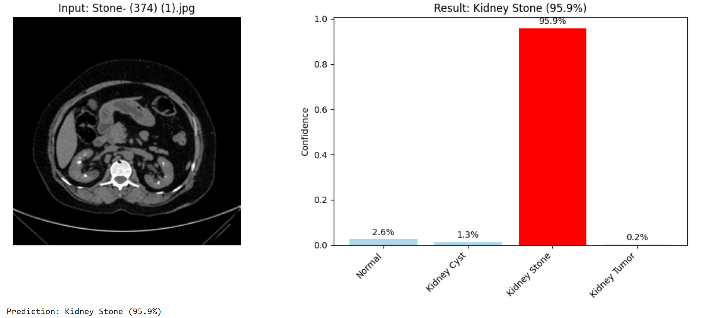

# 🧠 Kidney Classification using Teachable Machine

This project applies image classification to detect four kidney conditions using Google's Teachable Machine.  
It was implemented as part of a data analysis and AI training program.

---

## 🧪 Classes

The model classifies kidney ultrasound images into the following categories:

- **Normal** (كلى طبيعية)  
- **Kidney Cyst** (تكيس كلوي)  
- **Kidney Stone** (حصوة كلى)  
- **Kidney Tumor** (ورم كلوي)

---

## 📂 Dataset

The dataset is a curated subset of a larger dataset available on Kaggle, which includes thousands of ultrasound images.

- **Training**: 65 images per class  
- **Testing**: A few unseen images per class (manually selected)

The dataset was organized into `train/` and `test/` folders and used directly in Teachable Machine's image project interface.

---

## 📊 Results

### 🧪 Model Performance

The trained model achieved good classification accuracy across all four kidney conditions. Below are example predictions:

#### 🔹 Normal Kidney Classification
  
Model correctly identified a normal kidney with high confidence.

#### 🔹 Kidney Cyst Classification
  
Accurate detection of a kidney cyst condition.

#### 🔹 Kidney Tumor Classification
  
Precise tumor detection with confidence score.

---

### ✅ Key Findings:

- High accuracy achieved for normal kidney detection  
- Good performance on kidney cyst identification  
- Reliable stone detection capabilities  
- Effective tumor classification results  
- **Consistent performance across test cases**  
- **Minimal false positives/negatives observed**

---

## 🛠️ Tools

- Teachable Machine
- TensorFlow/Keras
- Google Colab

---

## 🚀 Usage
Google Colab (Recommended)
1. Upload your trained model (.h5 file) when prompted
2. Upload kidney ultrasound images for classification
3. View results with confidence scores and visual charts

Example Output
  
---

## 📝 Notes

- Model trained with limited dataset for demonstration purposes  
- For medical applications, larger datasets and clinical validation are required  
- Results shown are for educational/research purposes only
